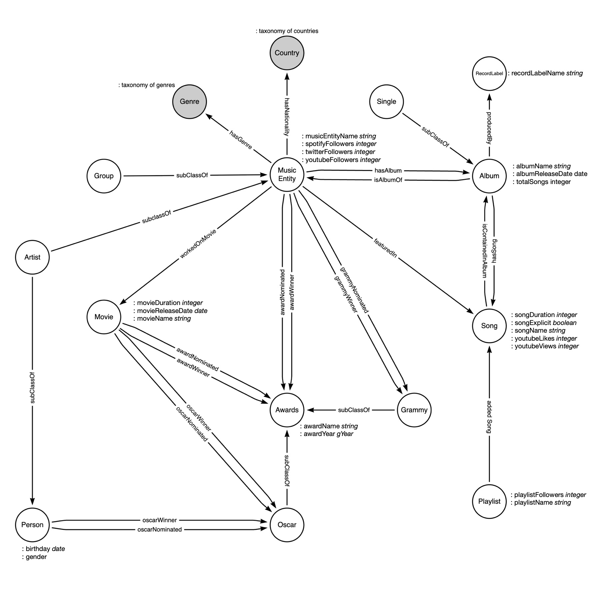

# grapho

## GRAPHO - Graph Databases Course - Prof. Gianmaria Silvello

### University of Padova - A.A. 2024-25

---

## Group Members

GRAPHO Group

| Surname   | Name    | ID      |
| --------- | ------- | ------- |
| Antonutti | Manuel  | 2130332 |
| Volpones  | Simone  | 2114260 |
| Zanon     | Tommaso | 2129677 |

---

## Domain of interest:

We chose to focus on the music industry, combining it with the domains of movies and social media. This decision was based on the large amount of public open data related to these areas and we thought it would be interesting to find links between them.

## Objective

The objective of this repository is to propose an ontology that can handle data about music. The proposed system aims to model:

- General information about MusicEntity (single Artist or Group) and its discography
- Information about user-generated Playlist
- Information about Movies in which an Artist has taken part

## DB download

[Click here](https://drive.google.com/file/d/1WgeK0cDiF5vbboyfYYpFqlsqa_HcDC_F/view?usp=sharing) to download the database.

## Ontology Diagram

The image provided above displays the class diagram for reference.
[`Ontology_without_data.ttl`](https://github.com/tommasozanon/grapho/blob/main/ontology/grapho-music-ontology-base.ttl)

## Organization of the Repository

The project is developed using:

- [draw.io](https://drawio-app.com/) for drawing the ontology model.
- [PROTÉGÉ](https://protege.stanford.edu/) for implementing the ontology model.
- [Python RDFlib](https://rdflib.readthedocs.io/en/stable/) for serializing the data.
- [GraphDB](https://www.ontotext.com/products/graphdb/) for querying the data.
